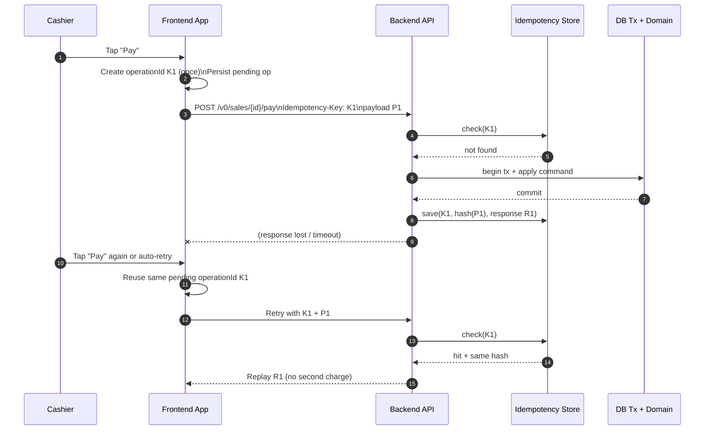
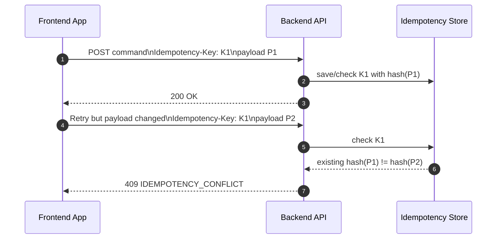

# Duplicate-Safe Command Execution in Modula v0 (Academic Notes)

Date: 2026-02-21  
Scope: `/v0` online write lane + offline push-sync lane

## Purpose

This document explains how Modula v0 prevents accidental duplicate processing.

It intentionally goes beyond idempotency and covers:
- pre-flight controls,
- in-flight controls,
- post-flight controls,
- transactional write and outbox guarantees.

## 1) Core Idea

Idempotency is only one part of the mechanism.

The full mechanism is **duplicate-safe command execution**:
1. stable intent identity,
2. retry semantics,
3. in-flight control,
4. state/invariant guards,
5. atomic commit,
6. replay-safe response behavior.

## 2) What Idempotency Actually Solves

Idempotency solves this specific case:

> the same user intent is retried because transport is unreliable (timeout/reconnect/retry).

Rules:
- same identity + same payload => replay prior outcome (no second side effect),
- same identity + different payload => conflict reject,
- different identity + same payload => treated as a new command.

So idempotency does **not** automatically stop all double taps.  
That is why we need the lifecycle controls below.

## 3) Lifecycle Controls (Pre/In/Post-Flight)

## A) Pre-Flight (before write starts)

- Validate actor/context/permissions.
- Validate command payload.
- Validate domain preconditions (example: sale unpaid, cash session active).

If preconditions fail, request is rejected before state mutation.

## B) In-Flight (while processing)

- Use one stable intent identity:
  - online: `Idempotency-Key` header,
  - offline push op: `clientOpId`.
- UI should lock/debounce destructive submit actions.
- Backend should enforce single in-progress path where needed (example: one payment intent per sale).

## C) Post-Flight (after processing)

- Persist terminal state transition (example: `PAID`, `FINALIZED`).
- Reject stale repeats with domain codes (`SALE_ALREADY_PAID`, etc.).
- Keep replay behavior deterministic for retries of the same intent.

## 4) Two Lanes in Modula v0

## A) Online direct write lane

Identity: `Idempotency-Key` per command request.

- First submission: process + commit + store identity/payload hash/response.
- Retry with same key and same payload: replay stored response.
- Retry with same key and different payload: `IDEMPOTENCY_CONFLICT`.

## B) Offline push-sync lane

Identity: `clientOpId` per operation inside `POST /v0/sync/push`.

- Uniqueness tracked by `(tenantId, branchId, clientOpId)`.
- Same op id + same payload hash: duplicate-safe replay.
- Same op id + different payload hash: deterministic conflict.

Important: in push-sync, dedupe is **operation-level**, not batch-level.

## 5) Why Transaction + Outbox Still Matter

Idempotency alone is insufficient for consistency.

We also need:
- **Transaction atomicity**: command writes all-or-nothing.
- **Outbox atomicity**: domain state + event record commit together.
- **Dispatcher**: publish committed outbox events reliably.

This prevents partial writes and lost downstream events.

## 6) Sequence Diagram: Duplicate-Safe Payment Flow

## 7) Sequence Diagram: Conflict Case

## 8) Frontend Implementation Rules

1. Generate identity once per user intent, not per HTTP attempt.
2. Persist pending operation state locally.
3. Retry with same identity until terminal outcome.
4. Do not reuse identity for a different payload.
5. For destructive actions, lock/debounce submit controls.

## 9) What This Means for Capstone Defense

Use this statement:

> Modula v0 does not rely on idempotency alone.  
> It uses a layered duplicate-safety model: preconditions + in-flight control + idempotent retry identity + transactional commit + post-state guards.

That is the defensible reason retries are safe while preserving correctness under unstable networks.

## 10) Edge Case Walkthrough (Applied to Our Earlier Questions)

### Edge Case A — Timeout after server commit, then retry

Scenario:
- First payment request commits successfully.
- Client never receives response (timeout).
- Client retries with the **same** identity.

Expected behavior:
- Online lane (`Idempotency-Key`) or offline lane (`clientOpId`) hits existing record.
- Backend replays prior successful outcome.
- No second charge/write occurs.

### Edge Case B — Double tap creates two different keys

Scenario:
- User taps `Pay` twice.
- Client generates `K1` and `K2` (different identities) for same payload.

Expected behavior:
- Idempotency treats them as two separate commands.
- Duplicate safety then relies on:
  - in-flight guard (one payment intent per sale),
  - post-flight state guard (`SALE_ALREADY_PAID` / equivalent).

Important:
- This is why idempotency alone is not enough for accidental double taps.

### Edge Case C — Same key reused with modified payload

Scenario:
- Client sends command with key `K1` and payload `P1`.
- Retry uses same key `K1` but payload is now `P2`.

Expected behavior:
- Backend compares payload hash.
- Returns conflict (`IDEMPOTENCY_CONFLICT`).
- Prevents ambiguous identity reuse.

### Edge Case D — Offline push is resent after reconnect instability

Scenario:
- `POST /v0/sync/push` operation with `clientOpId=C1` is applied.
- Device resends same operation due to reconnect instability.

Expected behavior:
- Backend sees existing `(tenantId, branchId, clientOpId)`.
- Same payload hash => `DUPLICATE/APPLIED` replay.
- Different payload hash => deterministic conflict/failure.

## 11) Practical Test Checklist (Manual/UAT)

1. **Retry safety test**  
   Send write with key `K1`, force timeout, resend same key + same payload => expect same result, no new side effect.

2. **Conflict safety test**  
   Reuse `K1` with changed payload => expect `IDEMPOTENCY_CONFLICT`.

3. **Double tap safety test**  
   Force two keys for one sale (`K1`,`K2`) => verify backend state guards prevent duplicate business outcome.

4. **Offline replay test**  
   Resend same `clientOpId` operation in push => expect `DUPLICATE/APPLIED`, not duplicate write.

## Related Docs

- `_academic/outbox-pattern-in-modula-v0.md`
- `_academic/offline-first-architecture-modula-v0.md`
