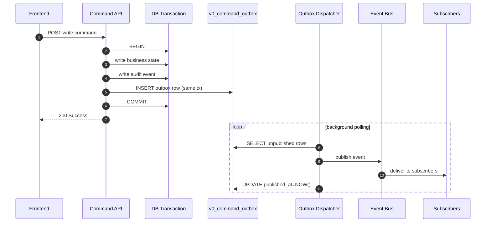
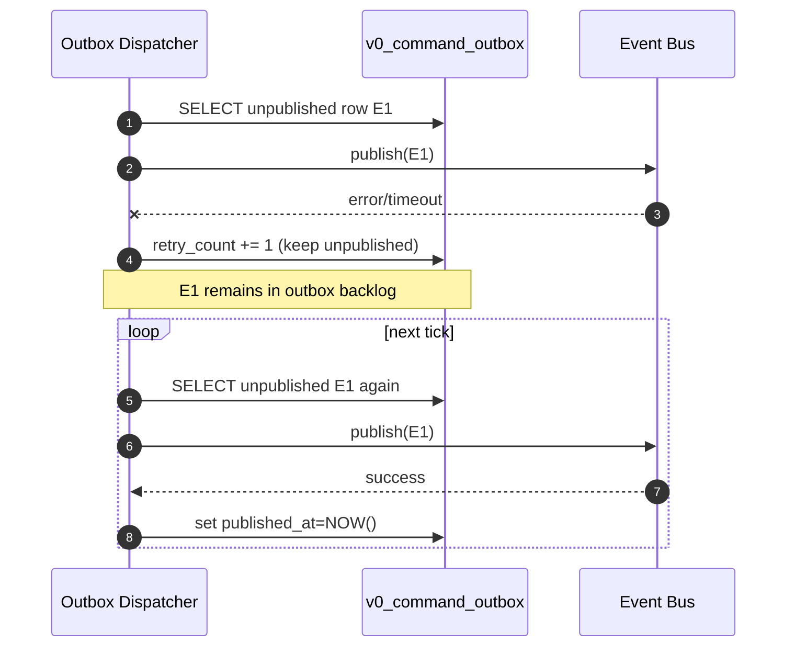

# Outbox Pattern in Modula v0 (Academic Notes)

Date: 2026-02-21  
Scope: reliable post-commit event publication in `/v0`

## Purpose

This note explains why Modula v0 uses the outbox pattern, how it works in our codebase, and how to defend the design in capstone discussion.

## 1) What Outbox Pattern Is

Outbox pattern is a reliability pattern for command-driven systems:

- write business state and an event record in the **same DB transaction**,
- commit both together or roll back both together,
- publish the event asynchronously later from the outbox table.

In short:

> Outbox separates **event recording** (transactional) from **event publishing** (asynchronous), while preserving correctness.

## 2) Problem Outbox Solves

Without outbox, a command can:
1. commit DB changes successfully, then
2. fail before publishing event/notification/sync signal.

Result: business state is saved, but downstream consumers never receive the event.

Outbox solves this by storing the event in DB **inside the same transaction** as the business write.

## 3) Real-World Failure Case (Without Outbox)

Example: POS checkout + stock deduction

1. Cashier finalizes a sale.
2. Backend commits:
   - sale = PAID,
   - inventory decrement.
3. Immediately after commit, process crashes before publishing the downstream event.

What breaks:
- operational notifications may never fire,
- pull-sync change feed may miss expected update trigger,
- reporting/analytics side consumers may stay stale,
- team sees “sale exists, but some downstream state never updated”.

This is a classic **committed state but lost event** failure.

## 4) Core Guarantee

If command transaction commits:
- business state is committed,
- audit is committed,
- outbox event row is committed.

Event publication is then retried asynchronously by dispatcher until success.

## 5) How Modula v0 Implements It

## A) Command transaction stage

Write routers run transactional command handlers and insert outbox row in the same transaction.

Example inventory write path:
- transaction start and command execution: `src/modules/v0/posOperation/inventory/api/router.ts:473`
- outbox insert in transaction: `src/modules/v0/posOperation/inventory/api/router.ts:504`
- outbox insert SQL: `src/platform/outbox/repository.ts:49`

## B) Dispatcher stage

Background dispatcher:
- polls `v0_command_outbox` for unpublished rows (`published_at IS NULL`),
- publishes to in-process event bus,
- marks row as `published_at=NOW()` on success,
- increments retry count and retries later on failure.

References:
- batch load and lock (`FOR UPDATE SKIP LOCKED`): `src/platform/outbox/dispatcher.ts:77`
- publish call: `src/platform/outbox/dispatcher.ts:133`
- mark published: `src/platform/outbox/dispatcher.ts:138`
- failure path/retry count: `src/platform/outbox/dispatcher.ts:163`

## C) Runtime bootstrapping

Dispatcher is started from runtime wiring:
- `src/platform/server/runtime-dispatchers.ts:39`
- outbox enable/poll/batch config: `src/platform/server/runtime-dispatchers.ts:40`
- dispatcher creation: `src/platform/server/runtime-dispatchers.ts:51`

## 6) Sequence Diagram (Happy Path)

## 7) Sequence Diagram (Failure + Retry)

## 8) Relationship to Idempotency

They solve different problems:
- **Idempotency**: protects command replay/retry from duplicate state mutation.
- **Outbox**: protects post-commit event delivery from loss.

Both are required:
1. idempotent command execution,
2. atomic outbox insert,
3. reliable async dispatch.

## 9) What Outbox Does Not Solve

- It does not dedupe user commands (idempotency does that).
- It does not define business policy conflicts (domain invariants do that).
- It does not guarantee exactly-once subscriber side effects by itself (subscribers should be idempotent).

## 10) Defense-Ready Summary

Use this line:

> In Modula v0, command writes and event records are atomically committed via outbox, then asynchronously dispatched with retry. This prevents “committed business state but lost event” failure mode.

## Related Docs

- `_academic/idempotency-in-modula-v0.md`
- `_academic/offline-first-architecture-modula-v0.md`
