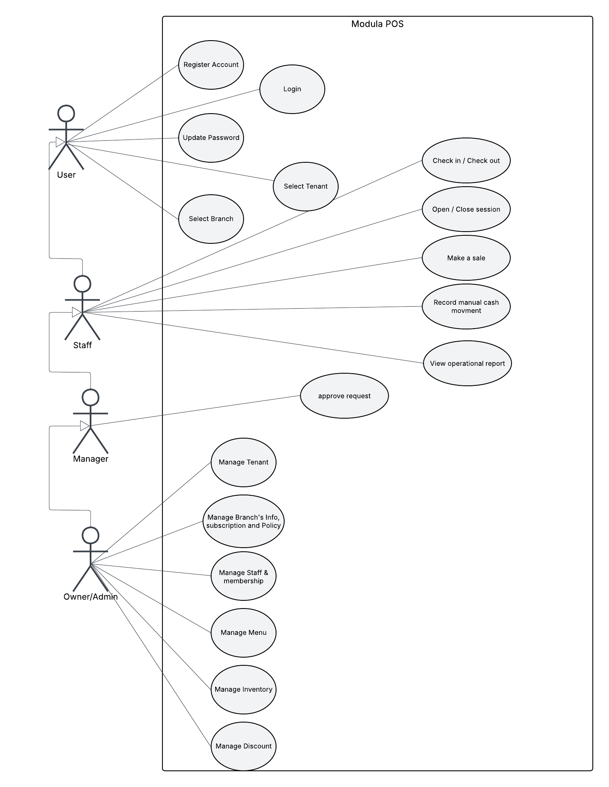
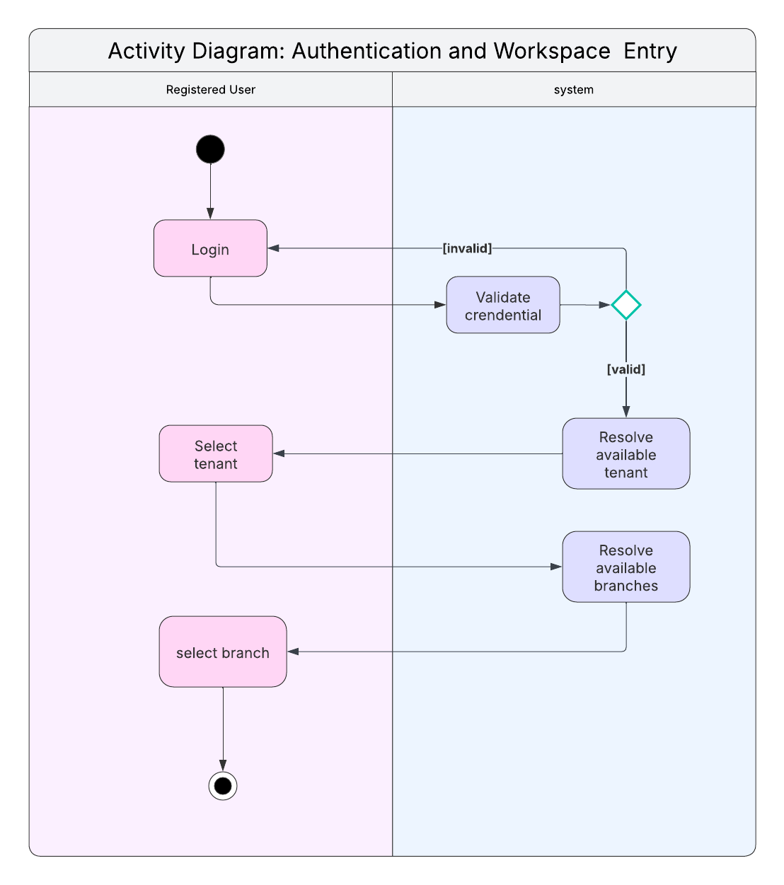
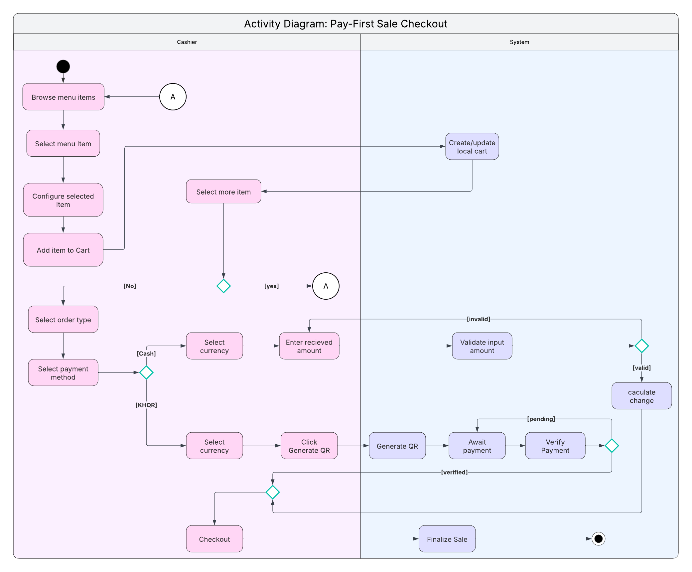

# 4. Project Analysis and Concepts

This chapter presents the system analysis and design concepts of Modula. Its purpose is to turn the project direction into concrete system requirements, quality attributes, and behavioral models. In other words, this chapter describes what the system is expected to do, how it is expected to behave, and what qualities it must preserve while doing so.

Compared to Capstone I, the analysis in Capstone II reflects a more mature understanding of the system. The earlier prototype made it clear that feature behavior alone was not enough. The project also needed cleaner workspace boundaries, stronger multi-tenant behavior, safer cross-module rules, and clearer handling of offline-first operation. For that reason, this chapter includes not only operational requirements such as sales, inventory, attendance, and cash handling, but also platform-level concerns such as synchronization, retry safety, and subscription-aware capability behavior.

This chapter is therefore concerned with **intended system behavior**, not implementation progress. Implementation state, deployment status, and frontend/backend completion are addressed elsewhere in the report. Advanced analytics and business intelligence remain outside the main Capstone II scope unless they are explicitly implemented and evaluated later.

---

## 4.1 Functional Requirements

This subsection defines the functional requirements of the Modula system, specifying the core behaviors the system must provide to support daily operations. Each requirement is written to be clear, testable, and aligned with the project scope.

The functional requirements are organized by operational domain for clarity and traceability.

---

### 4.1.1 User Authentication and Authorization

The system shall provide secure authentication and role-based authorization to control access to system features and data.

- The system shall allow users to create an account using a phone number and password.
- The system shall verify user identity using OTP during account registration and recovery flows.
- The system shall allow users to log in using a phone number and password after verification.
- The system shall support role-based access control with predefined roles (e.g., Admin, Manager, Cashier).
- The system shall restrict access to features and data based on the authenticated user’s role and selected tenant/branch context.
- The system shall allow a single user account to be associated with multiple tenants, enabling one user to operate across multiple businesses.
- The system shall maintain authenticated sessions to ensure continuity during active operations.

These requirements ensure security, accountability, and controlled access in a multi-user POS environment.

---

### 4.1.2 Sales and Order Processing

The system shall support end-to-end sales processing, from item selection to order fulfillment.

- The system shall allow authorized users to create sales by selecting menu items and applicable modifiers.
- The system shall support different sale types, including dine-in, take-away, and delivery.
- The system shall allow users to review and modify a cart before checkout (quantities, modifiers, discounts).
- The system shall calculate item-level subtotals, discounts, tax (VAT where applicable), and grand totals.
- The system shall support transactions in both USD and Khmer Riel (KHR), including clear display and rounding behavior.
- The system shall support payment methods appropriate to branch policy and operational setup, including cash and KHQR-assisted payment.
- The system shall require payment confirmation before finalizing a KHQR-based sale.
- The system shall finalize sales into orders with defined lifecycle states such as in-prep, ready, served/delivered, void-pending, and voided.
- The system shall support a pay-later workflow where an order/open ticket may be created before payment and later settled through checkout, subject to policy enablement.
- The system shall prevent unauthorized modification of finalized or voided sales while preserving a complete audit trail.

Optional operational mode (Capstone II design):
- The system shall support both **pay-first** and an optional **pay-later** workflow (open ticket), controlled by tenant policy.

---

### 4.1.3 Inventory Management

The system shall provide inventory management capabilities to support stock visibility and control.

- The system shall allow administrators to create, update, archive, and restore stock items.
- The system shall allow stock items to exist without a category and be treated as uncategorized.
- The system shall maintain inventory quantities at the branch level.
- The system shall record all inventory changes using a journal-based approach to preserve a complete history of stock movements.
- The system shall support restocking and manual adjustments as controlled inventory movements.
- The system shall automatically deduct inventory quantities when a sale is finalized, subject to inventory capability enablement and the evaluated tracked composition of the sold items.
- The system shall preserve historical inventory records even when items are archived.

---

### 4.1.4 Menu Management

The system shall support flexible configuration of menus used during sales operations.

- The system shall allow administrators to create, update, archive, and restore menu items.
- The system shall allow menu items to be organized into categories while permitting items without categories to remain uncategorized.
- The system shall allow administrators to create and manage modifier groups/options and assign them to menu items.
- The system shall support modifier-based price adjustments that contribute to final item price.
- The system shall allow administrators to define menu item composition so sold items can be linked to tracked or non-tracked components used in downstream inventory behavior.
- The system shall allow menu items to be assigned to one or multiple branches and removed from branch availability without deletion.
- The system shall preserve historical sales data even when menu items are archived.

---

### 4.1.5 Cash Session and Cash Handling

The system shall support controlled cash handling through structured cash session management.

- The system shall allow authorized users to start and close cash sessions with recorded opening and closing cash amounts.
- The system shall enforce at most one OPEN cash session per branch at a time.
- The system shall associate cash-based sales with an active cash session as part of the branch’s operational accountability rules.
- The system shall support cash movements including paid-in, paid-out, and privileged manual adjustments, while preserving an auditable movement history.
- The system shall calculate expected cash totals and cash variance upon session closure.

Approval and operation mode note (Capstone II design):
- In team operations, truth-changing refund/void execution shall remain under an authorized approval boundary.
- In solo operations, the system shall still preserve auditability and cash accountability without introducing an unnecessary request/approve loop for the same operator.

---

### 4.1.6 Staff Attendance Management

The system shall support staff attendance tracking to record work sessions and support operational accountability.

- The system shall allow staff members to start and end work sessions based on branch context.
- The system shall prevent a staff member from having multiple active work sessions simultaneously.
- The system shall preserve attendance records as immutable historical data.
- The system shall allow administrators and managers to view attendance history for authorized scope.
- The system shall allow attendance evidence such as shift alignment or location verification to be recorded where supported.

Policy note (Capstone II baseline):
- Shift alignment and location verification may be captured as evidence/signals, but should not block work start/end by default.

---

### 4.1.7 Discount Management

The system shall support discount management to enable promotional pricing with predictable outcomes.

- The system shall allow administrators to create discount rules scoped to a branch.
- The system shall support discount types including percentage discounts and fixed-amount discounts.
- The system shall support item-level, category-level, and sale-level discount scopes.
- The system shall allow discount rules to remain inactive until explicitly activated and to become ineligible automatically when their configured validity ends.
- The system shall restrict editing of discount rules to states where the rule is not currently active.
- The system shall apply eligible discounts during sale calculation once configured.
- The system shall lock applied discounts into finalized sales to prevent retroactive modification.
- The system shall define deterministic stacking behavior for overlapping discounts.

---

### 4.1.8 Reporting and Records

The system shall provide basic reporting capabilities to support operational oversight.

- The system shall generate sales reports summarizing transactions within a selected time period.
- The system shall include pending void transactions in reports with appropriate status indicators.
- The system shall generate inventory views/reports reflecting current stock levels (where inventory capability is enabled).
- The system shall restrict reporting access to authorized roles.

---

### 4.1.9 Policy Management

The system shall support branch-scoped policy management for operational settings that influence sale behavior.

- The system shall allow authorized administrators to view and update branch-scoped policy values from tenant-level management surfaces using an explicit target branch.
- The system shall support policy values for tax and currency behavior, including VAT, exchange rate, and rounding configuration.
- The system shall support branch-scoped workflow policy values such as pay-later enablement.
- The system shall resolve effective policy values by branch so downstream modules use the correct operational configuration.
- The system shall preserve historical correctness by ensuring policy updates do not retroactively rewrite finalized sales, receipts, or historical records.

---

### 4.1.10 Offline Operation and Synchronization

The system shall support offline-first operation to ensure business continuity during network disruptions without compromising backend integrity.

- The system shall allow selected operational actions to proceed while offline using locally cached data.
- The system shall queue offline actions locally as durable operations and synchronize them when connectivity is restored.
- The system shall ensure replay is idempotent to prevent duplication under retries.
- The system shall support authoritative pull/hydration so clients converge to server truth without per-module polling.
- The system shall revalidate authorization and operational prerequisites on synchronization.

---

### 4.1.11 Subscription, Entitlements, and Branch Activation (Capstone II)

The system shall support subscription-aware enablement of capabilities while keeping operational behavior deterministic and auditable.

- The system shall treat a branch as a billable workspace unit that requires paid activation.
- The system shall prevent unpaid operational branches from existing.
- The system shall gate optional capabilities (modules) at the branch scope:
  - enabled modules allow normal write operations,
  - disabled modules remain visible but are read-only, and
  - cross-module side effects into a disabled module must be skipped deterministically (without breaking sale validity).

TODO_CAPSTONE2(FLAG-PM-01): confirm when subscription/billing flows are expected to be demoable during Capstone II.

---

## 4.2 Non-Functional Requirements

This subsection defines non-functional requirements of Modula, focusing on quality attributes that determine how well the system performs its intended functions. These requirements are derived from the operational context of small and medium-sized businesses and technical constraints discovered during implementation.

### 4.2.1 Security

- The system shall enforce role-based access control to restrict sensitive actions.
- The system shall verify account ownership during registration and recovery through OTP-based identity verification.
- The system shall ensure authentication credentials are securely handled and never exposed in plaintext.
- The system shall prevent unauthorized modification of finalized transactional data (sales, cash movements, inventory journal, attendance).
- The system shall record critical actions in an audit log for traceability and accountability.

### 4.2.2 Performance

- The system shall support rapid item selection and checkout workflows to minimize customer wait times.
- The system shall perform core calculations (cart totals, discounts, tax) with minimal latency.
- The system shall support efficient synchronization (push replay and pull hydration) without blocking core UX unnecessarily.

### 4.2.3 Usability

- The system shall minimize manual decision-making during sales by automating calculations (discounts, tax, currency conversion).
- The system shall provide role-appropriate interfaces so users see features relevant to their responsibilities.
- The system shall make workspace context clear so users can understand whether they are acting at account, tenant, or branch level.
- The system shall support a responsive UI across small and wide screens for operational workflows.

### 4.2.4 Reliability

- The system shall preserve data integrity under unstable connectivity and retries.
- The system shall ensure critical ledgers (cash session movements, inventory journal) are durable and append-only where applicable.
- The system shall ensure idempotent write behavior under retries and offline replay.
- The system shall ensure clients converge back to authoritative backend state after reconnection and synchronization.
- The system shall avoid inconsistent intermediate states by applying reliable cross-module execution patterns (e.g., outbox/eventual processing where used).
- The system shall preserve historical records even when entities are archived or access is revoked.

### 4.2.5 Portability

- The system shall be accessible through modern web browsers on phones, tablets, and computers.
- The system shall not require dedicated POS hardware to perform core operations by default.

### 4.2.6 Maintainability

- The system shall adopt a modular architecture separating core modules from feature modules.
- The system shall centralize cross-cutting concerns such as access control, policy enforcement, entitlements, idempotency, offline sync, and audit logging.
- The system shall limit inter-module coupling to clearly defined interfaces and contracts.

### 4.2.7 Scalability

- The system shall support multiple tenants within a single deployment.
- The system shall support expansion from single-branch to multi-branch operations.
- The system shall support growth from solo-operator usage into team-based operation without redesigning core workflows.
- The system shall allow new feature modules and vertical capability upgrades without disrupting existing workflows.

---

## 4.3 System Users and Behavioral Modeling

This subsection analyzes the system from a user and behavioral perspective by identifying system actors and illustrating their interactions through use case and activity diagrams.

### 4.3.1 System Users

This subsection identifies the primary users of the Modula system and explains their responsibilities and access boundaries. Defining these actors clearly is important because Modula is not a single-user application. It is a role-based system in which account access, workspace entry, management capability, and operational responsibility vary according to the user’s position in the business.

The first actor is the general **User** at the account and workspace-entry level. This actor covers actions such as registering an account, logging in, updating a password, accepting or rejecting membership invitations, selecting a tenant, and selecting a branch. At this level, the concern is not yet detailed operational privilege, but successful entry into the correct workspace context.

The second actor is **Staff**, representing frontline operational users working inside a branch workspace. Staff are responsible for day-to-day branch work such as attendance actions, sales execution, cash-session participation, recording allowed cash movements, and accessing operational records within their permitted scope. Their role is primarily operational rather than administrative.

The third actor is **Manager**, representing supervisory users who extend the capabilities of staff. In addition to normal branch operations, managers may review operational information, supervise staff activity, and approve selected sensitive requests according to business rules. This actor reflects the need for oversight inside branch operations without granting full tenant-management authority.

The fourth actor is **Owner/Admin**, representing the highest level of authority within the current system scope. This actor may manage tenant and branch settings, maintain staff and membership records, and manage menu, inventory, and discount configuration. In practice, this actor may also perform operational actions when needed, but the distinguishing feature is broader management authority across the tenant.

This separation of users reflects how the system is intended to operate in practice. Small businesses may run close to a solo-operator mode, while larger branches depend on clearer separation between frontline staff, managers, and owners or administrators. The role model therefore supports both simple and more structured operating environments without changing the core system behavior. The use case diagram that follows acts as a compact visual summary of this actor model by grouping their major interactions into account and workspace entry, branch-level operation, and tenant-level management.

### 4.3.2 Use Case Diagrams

Figure 4.x presents a single high-level use case view of Modula POS. The diagram remains intentionally abstract so that it can show the main actor capabilities without expanding internal checks and implementation detail.

One important aspect of the figure is the use of actor inheritance. In this diagram, **Staff** specializes **User**, **Manager** specializes **Staff**, and **Owner/Admin** specializes **Manager**. This is used to communicate cumulative responsibility in a compact way: higher roles retain the basic account and workspace-entry actions of lower roles, while also gaining additional operational or management capabilities. The inheritance shown in the diagram should therefore be read as a simplified role hierarchy, not as a claim that all actions are always available without scope checks. Tenant membership, branch assignment, and business rules still determine whether a concrete action is actually allowed at runtime.

The diagram can also be read in three capability groups. The first group covers **account and workspace entry**, such as account registration, login, password update, invitation handling, tenant selection, and branch selection. The second group covers **branch-level operation**, such as attendance, cash-session work, sales execution, cash movement recording, and access to operational reporting. The third group covers **tenant-level management**, where higher-privilege actors manage tenant settings, branch settings, staff and membership, menu, inventory, and discounts.

### 4.3.3 Activity Diagrams

Activity diagrams illustrate dynamic behavior of the Modula POS system from a user-oriented perspective. The diagrams included in this section focus on key workflows that represent core system behavior.

---

## 4.3.3 Activity Diagrams (Textual Specification)

### Activity Diagram: User Authentication and Workspace Entry (Capstone II)

1. Start
2. User opens the application
3. Decision: user has an existing account?
   - No: user registers (profile fields + phone verification via OTP + password setup)
   - Yes: user logs in using phone number and password
4. System loads the user’s tenant memberships and pending invitations
5. Decision: user has at least one active membership?
   - Yes: user selects a tenant
   - No: user views invitations (accept/reject) or creates a new tenant (if intended as business owner)
6. System enters the selected tenant workspace
7. Decision: user is entering branch-layer operational work?
   - Yes: system resolves eligible branch context and the user selects a branch before entering branch workspace
   - No: user remains in tenant workspace for management or branch entry
8. Redirect user to role-appropriate workspace shell
9. End

Figure explanation. This diagram presents the main authenticated path for entering operational workspace. A registered user logs in, the system validates the credentials, and invalid input returns the user to the login step. Once authentication succeeds, the system resolves available tenants and branches, after which the user manually selects the tenant and branch needed for work. The figure intentionally stays compact, so registration, invitation handling, and no-membership edge cases are explained in the surrounding text rather than expanded in the diagram.

### Activity Diagram: Sale and Order Creation (Pay-First Baseline)

1. Start
2. Operator enters branch workspace and opens Sale module
3. System validates branch operational context and checks for an active cash session
   - If no active session exists: prompt user to start cash session
4. Operator adds menu items to cart
5. Operator selects sale type (dine-in, take-away, delivery)
6. System calculates subtotal, eligible discounts, tax, and grand total
7. Operator selects payment method
8. Decision: payment method is KHQR?
   - Yes: system requires payment confirmation before finalization
   - No: continue
9. Operator confirms checkout
10. System finalizes sale
11. System creates or updates the fulfillment order
12. System generates receipt/eReceipt record
13. End

Figure explanation. This diagram shows the pay-first sale flow from menu browsing to sale finalization. The cashier browses and configures items, adds them to the cart, and may continue selecting more items before moving to order type and payment selection. The flow then splits into cash and KHQR paths. In the cash path, the operator enters the received amount and the system validates it before calculating change. In the KHQR path, the operator triggers QR generation, the system produces the QR, and payment remains pending until verification succeeds. Both payment paths converge at checkout, after which the system finalizes the sale. Downstream effects such as receipt generation, inventory deduction, and post-finalization processing are intentionally abstracted from the figure for readability.

Optional extension (Capstone II design): Pay-later
- If pay-later is enabled, the system supports creating an open ticket/order without immediate payment finalization, and later settling it through checkout.
