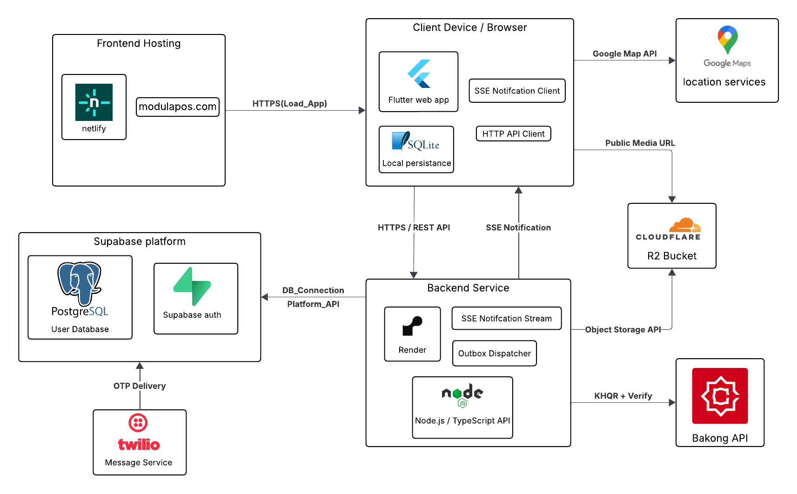
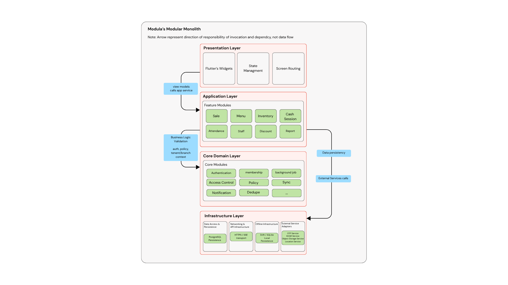

# 5. Detail Concepts

This chapter presents the detailed design concepts behind Modula, including the choice of technology and the system architecture. Compared to Capstone I, Capstone II places more emphasis on production-oriented concerns such as offline-first synchronization, reliability under retries, and the practical deployment model of the current staging system. The chapter therefore combines design rationale with the concrete runtime decisions that have already been implemented in staging.

---

## 5.1 Choice of Technology

The Modula POS system was developed using a modern, cross-platform technology stack designed to support scalability, maintainability, and gradual product evolution from an academic prototype into a production-ready system. The selection of programming languages and frameworks was guided not only by technical capability, but also by practical considerations such as team size, long-term maintainability, and alignment with the project’s vision of providing an affordable and accessible POS solution for small and medium-sized businesses.

### 5.1.1 Language and Framework

Modula uses a modern, cross-platform technology stack designed to support maintainability and gradual evolution from an academic prototype into a production-oriented system.

For the frontend, Modula uses **Flutter** with **Dart**, supported by **Riverpod** for state management and dependency injection. Flutter was selected to support a single codebase with a consistent experience across device sizes. In Capstone II, Modula prioritizes responsive usability for both **small screens (smartphones)** and **wide screens (tablets and desktops)**.

For the backend, Modula is implemented using **TypeScript** on a Node.js runtime. TypeScript was selected to provide static typing and safer refactoring in a system where multiple modules exchange structured data (sales, inventory, policy enforcement, synchronization, and auditability).

**Flutter** was selected because it allows Modula to keep a single cross-platform codebase while still delivering a responsive POS experience across phones, tablets, and desktops. That decision fits the project’s long-term direction: Capstone II focuses on a web deployment, but the same UI architecture can later support mobile delivery without rewriting the product from scratch. Flutter also fits the project’s feature-based modular structure, where sales, inventory, attendance, menu management, and reporting can evolve as separate frontend areas without losing overall consistency.

**Dart** strengthens that frontend structure through static typing, explicit imports, and compile-time validation. In Modula, those language properties matter because different roles interact with different parts of the system and the frontend exchanges structured data with the backend across workflows such as checkout, cash handling, and attendance. Stronger typing helps reduce boundary mistakes and makes state transitions more predictable in areas where inconsistent client state could create operational or financial errors.

**Riverpod** is used for state management and dependency injection in the Flutter frontend. It supports the project’s modular design by allowing feature-specific state to remain isolated while shared context such as authentication, tenant selection, branch selection, and policy values can still be consumed consistently. This improves maintainability, testability, and dependency clarity across the frontend.

On the backend, Modula uses **Node.js** with **TypeScript**. This combination was chosen to support a modular server application with strongly typed contracts between modules and safer refactoring as requirements evolved from prototype behavior into more production-oriented workflows. In Modula, backend modules exchange structured data for sales, inventory, cash movement, policy evaluation, synchronization, and audit logging, so stronger typing directly improves consistency and reduces contract drift during implementation and integration.

Together, Flutter, Dart, Riverpod, Node.js, and TypeScript form a complementary stack that supports Modula’s design philosophy of modularity, clarity, and gradual evolution.
  

### 5.1.2 Databases

Modula uses two complementary persistence layers. PostgreSQL serves as the authoritative system of record for transactional and operational data such as sales, orders, inventory journals, cash sessions, attendance, policies, and audit logs. On the client side, the frontend uses Drift-based local persistence over SQLite. In the web deployment, that SQLite database is persisted through an IndexedDB-backed virtual file system. This client-side layer supports offline-first behavior by holding cached reference data, durable offline queues, and device checkpoints or cursors for incremental hydration. The authoritative source of truth nevertheless remains the server-side database, while the client-side store is used for resilience, performance, and controlled convergence through push replay and pull hydration.

**PostgreSQL** is used as the authoritative backend database and serves as the system of record for all critical business data. This includes sales transactions, orders, inventory records, cash session data, attendance logs, policies, and audit logs. PostgreSQL was selected primarily for its strong support of ACID (Atomicity, Consistency, Isolation, Durability) properties, which are essential in POS environments where financial accuracy and data consistency are critical. Operations such as finalizing a sale, deducting inventory, recording cash movements, and updating reports often involve multiple related data changes that must be committed atomically. PostgreSQL ensures that these operations are executed reliably and consistently, even in the presence of system failures. In addition, PostgreSQL’s relational data model is well-suited to the structured nature of POS data. Modula manages entities such as tenants, branches, users, menu items, stock items, orders, and policies, many of which have well-defined relationships. PostgreSQL allows these relationships to be enforced through foreign keys and constraints, reducing reliance on application-level validation and helping maintain long-term data integrity as the system evolves. Its advanced querying and aggregation capabilities also support reporting requirements such as sales summaries, inventory status, and cash reconciliation, which are fundamental features of POS systems.

**Drift / SQLite local persistence** complements the backend database by providing the application’s local relational persistence layer. This is the correct architectural description because the frontend code interacts with a structured relational model through Drift rather than directly using IndexedDB as a document or key-value store. In the web deployment, the SQLite database is persisted in the browser through an IndexedDB-backed virtual file system. This allows the application to keep the same relational access model while still using browser storage as the underlying persistence substrate. This local persistence layer supports offline operation, local caching, and data synchronization. It holds cached reference data, queued write operations, and synchronization state while preserving a more structured query and schema model than raw browser storage would provide. That choice fits the project’s modular direction because it keeps client-side data access consistent with the application’s offline-first and synchronization design. The interaction between PostgreSQL and Drift/SQLite follows a clear responsibility separation. PostgreSQL remains the authoritative source of truth for all persistent business data, while the client-side relational store is used for local state, caching, and controlled convergence. This hybrid design allows Modula to balance reliability, performance, and data consistency while keeping the frontend on a stronger relational persistence model.

Overall, the combined use of PostgreSQL and Drift/SQLite local persistence enables Modula to support transactional accuracy, efficient reporting, offline resilience, and reduced network dependency. This database architecture directly supports the system’s modular design and contributes to its ability to scale from an academic prototype into a practical, real-world POS solution.

### 5.1.3 Tools

The project uses a practical toolchain for development, documentation, testing, and collaboration. **GitHub** is used for version control and team collaboration, **Jira** is used for Capstone II task tracking and scope monitoring, **Postman** is used for backend API testing, **Markdown-based API contract documents** are used to share backend contracts with the frontend team during implementation, **Visual Studio Code** is the primary development environment, and **Figma** is used for UI and UX design review.

In Capstone II, API contracts were no longer maintained primarily through Swagger-style documentation. Instead, the backend team documented endpoint contracts in Markdown and shared those documents directly with the frontend team. This approach fit the project’s working style better during active implementation because it was easier to revise alongside evolving business rules, synchronization behavior, and feature-specific edge cases.

TODO_CAPSTONE2(FLAG-PM-04): add a short description of the Jira workflow used in Capstone II (board structure, issue types, and how scope changes were tracked).

---

## 5.2 Architecture of the Web Application

### 5.2.1 Physical Architecture

The physical architecture of Modula in Capstone II describes the deployed runtime arrangement of the system rather than a vendor-neutral future model. This section therefore names the actual runtime components, their main responsibilities, and the communication boundaries between them.

#### Physical Architecture Overview Diagram

Figure 5.x summarizes the deployed physical architecture of the current staging system, including the main runtime services, supporting external providers, and the communication paths between them.

#### Current Staging Deployment

As shown in Figure 5.x, the deployed system uses concrete infrastructure choices rather than the provider-agnostic assumptions carried over from Capstone I. The frontend is hosted on **Netlify** and exposed through **modulapos.com**, the backend runs on **Render** at **https://modulabackend.onrender.com**, the authoritative relational database runs on **Supabase PostgreSQL**, and object storage is provided through **Cloudflare R2**. OTP delivery is integrated through **Twilio**, although the deployed environment currently relies on a fallback OTP path. Sale payment confirmation uses direct cash handling or **Bakong KHQR**, while billing and branch-activation confirmation still use a simulated verifier rather than a live external billing-payment provider.

#### Client Layer

The client layer consists of smartphones, tablets, and desktop or laptop browsers running the Flutter web application. In addition to rendering the user interface and collecting user input, the browser runtime includes local persistence built with Drift over SQLite, browser-backed storage for that local database, and an SSE client for operational notifications. This client-side persistence stack supports the system’s offline-first behavior by holding cached reference data, queued offline operations, and synchronization progress while the backend remains authoritative for business state.

#### Frontend Delivery

The frontend is delivered as static web assets generated from the Flutter build. These assets are hosted through Netlify and exposed publicly through `modulapos.com`, with Netlify also providing the edge-delivery layer. When a user opens the application, the browser first loads the static assets from the frontend host and then communicates with the backend over HTTPS. Although the web build includes standard browser application packaging metadata, service-worker or PWA caching is not treated in this report as a primary application-level runtime subsystem.

#### Backend Application Layer

The backend executes as a server-side Node.js/TypeScript application and acts as the central authority for business rules. It exposes the operational APIs used by the frontend for authentication, workspace entry, sales, cash session, attendance, inventory, discounts, policy resolution, and synchronization, as well as an SSE-based operational-notification stream from backend to client. It also includes in-process background responsibilities for reliable post-commit work, including the outbox dispatcher and polling or reconciliation work when an external provider does not supply the required confirmation path.

#### Authoritative Database Layer

Persistent operational data is stored in PostgreSQL. This includes sales and orders, inventory journals, cash sessions, attendance records, policies, audit logs, synchronization records, and other tenant- and branch-scoped operational state. The database remains the authoritative source of truth for business state, while the client-side store exists only to support resilience and convergence.

#### Object Storage and Supporting Services

Media assets such as menu and item images are stored outside the database in Cloudflare R2. Uploads flow from client to backend and then from backend to R2 through an S3-compatible object-storage API, while media reads primarily use direct browser access to the public R2 URL. OTP delivery is treated as a backend-controlled external service through Twilio, although the deployed environment still uses a fixed-OTP fallback path because some Cambodian carriers block SMS from long-code senders. Payment verification is also backend-controlled: cash requires no external provider, KHQR payment is verified through Bakong after customer payment, and billing or branch-activation confirmation remains separate because that path still uses a simulated verifier rather than a live external billing-payment provider.

#### Communication Model

All communication follows backend-centered boundaries for business operations. The browser loads static assets from the frontend host and sends operational requests to the backend through HTTPS APIs. Payment-verification status is checked by the frontend through backend polling endpoints, and operational notifications are delivered through the SSE notification stream rather than through a general synchronization channel. The backend performs transactional reads and writes against PostgreSQL, accesses object storage through provider APIs, and calls external OTP and payment services where required. The main exception is media delivery: after upload is handled through the backend, the browser primarily reads media directly from the public R2 URL. Outside of this media-read path, client devices do not communicate directly with the database or external providers.

---

### 5.2.2 Logical Architecture

Modula adopts a modular monolithic logical architecture. This choice is deliberate. The system has many cross-module business invariants, such as sale finalization affecting cash accountability, inventory deduction, receipts, audit logging, synchronization, and notifications. For a small team and an evolving product, placing these concerns inside one coherent deployable system is more practical than splitting them early into distributed services. The modular monolith approach reduces operational complexity while still allowing clear separation of responsibilities and disciplined boundaries between modules. It also fits the final Capstone II state, where offline-first behavior, operational notifications, payment verification, and background reliability mechanisms now operate as part of one coordinated runtime rather than as separate experimental subsystems.

#### Logical Architecture Diagram

Figure 5.x presents Modula’s modular monolithic logical architecture. It summarizes the four-layer structure used in Capstone II, where the Presentation Layer depends on feature workflows in the Application Layer, feature workflows consume shared guarantees from the Core Domain Layer, and the Infrastructure Layer provides persistence, transport, background execution, and external-service adapters.

#### Layered Architectural Model

As shown in Figure 5.x, Modula’s logical architecture is organized into four primary layers: the Presentation Layer, the Application or Feature Layer, the Core Domain Layer, and the Infrastructure Layer. The dependency direction is intentionally strict. Presentation interacts through application-level workflows. Feature modules depend on core rules and shared capabilities. Infrastructure provides technical adapters and execution mechanisms, but does not define business meaning by itself. This keeps the architecture easier to evolve as the system moves from prototype behavior toward a more production-oriented product.

#### Presentation Layer

The Presentation Layer is implemented in Flutter and is responsible for user-facing interactions across phone, tablet, and desktop-sized screens. It includes the account, tenant, and branch workspace surfaces, feature-specific screens, and browser-side runtime support such as HTTP API access, SSE notification consumption, and local persistence through Drift over SQLite. Riverpod is used to manage state in a modular way across feature surfaces and shared context. In the final Capstone II implementation, this layer not only renders the interface but also participates actively in synchronization by maintaining local state, consuming operational notifications, and triggering pull-based convergence through frontend lifecycle events such as hydration, reconnect, and workspace change.

The role of this layer is to present state and collect user intent, not to act as the final source of business truth. The UI may hide or disable actions based on roles, policy values, or entitlements, but final enforcement is always performed through backend authorization and validation. This keeps the client responsive and offline-capable while preserving a server-authoritative model for business invariants.

#### Application (Feature) Layer

The Application Layer contains feature modules for sales and orders, menu management, inventory, cash sessions, attendance, discounts, receipts and reporting, and operational notifications. These feature modules orchestrate business workflows. A sale workflow, for example, may need to consult active cash session rules, policy values, discount eligibility, KHQR payment confirmation, duplicate-safe command handling, inventory side effects, receipt generation, and audit recording. A notification workflow may need to interpret business events, format them for operator-facing use, and expose them through the notification stream without duplicating rules that already belong elsewhere. The feature layer coordinates such flows, but it does not own cross-cutting enforcement by itself. Instead, it consumes shared guarantees from the Core Domain Layer so that authorization, policy interpretation, synchronization rules, and reliability behavior remain consistent across modules.

#### Core Domain Layer

Core modules provide system-wide guarantees and shared services for authentication and tenant membership, access control, tenant and branch context, policy resolution, subscription entitlements and capability gating, offline sync contracts, duplicate-safe command execution, audit logging, notification stream semantics, and background execution contracts for outbox dispatch and reconciliation work. These core services are where Modula’s most important non-trivial guarantees are located. Offline-first behavior is not treated as a UI convenience only; it is modeled as a dual-lane system in which direct online writes and replayed offline writes must converge to the same server-authoritative outcome through push replay and authoritative pull hydration. Duplicate-safe execution also belongs here conceptually, because retry identity, state guards, and deterministic replay rules protect command correctness across both normal online requests and replayed offline operations. Audit, entitlement, and notification semantics are handled here for the same reason: they must remain consistent no matter which feature initiates the action.

#### Infrastructure Layer

The Infrastructure Layer provides the technical adapters and execution primitives needed to persist state and talk to external systems. In Modula, this includes PostgreSQL access and transactional persistence, Cloudflare R2 object-storage integration, Supabase Auth and Twilio-backed OTP integration paths, Bakong integration paths for KHQR generation and payment verification, direct provider webhook-ingestion routes where required by particular integrations, in-process background runners such as the outbox dispatcher, and the HTTP and SSE transport mechanisms used at runtime. This layer is responsible for how the system talks to its technical environment, not for deciding business policy. For example, it can run a polling or reconciliation task for payment confirmation, persist outbox rows, publish notification events, or expose transport endpoints, but the meaning of those actions in relation to sale state, sync state, or operator-visible behavior still belongs to the application and core layers. Likewise, the outbox dispatcher is an infrastructure execution mechanism, while the decision that an event must exist and be delivered reliably is part of the system’s deeper reliability model.

#### Inter-Layer Communication

Communication across layers follows a constrained flow. The Presentation Layer sends user intent into feature workflows. The Application Layer coordinates use-case execution and consults the Core Domain Layer for authorization, context, policy, entitlements, synchronization rules, and reliability constraints. The Infrastructure Layer is then used to persist state, call external providers, emit notifications, and run deferred work. Direct UI-to-infrastructure coupling is intentionally avoided so that runtime changes, provider changes, or storage changes do not force business logic to leak into the interface. This separation is particularly important in Modula because the same logical workflow may execute through the direct online lane, the offline replay lane, or a background reliability path and still be expected to converge to the same authoritative outcome.
