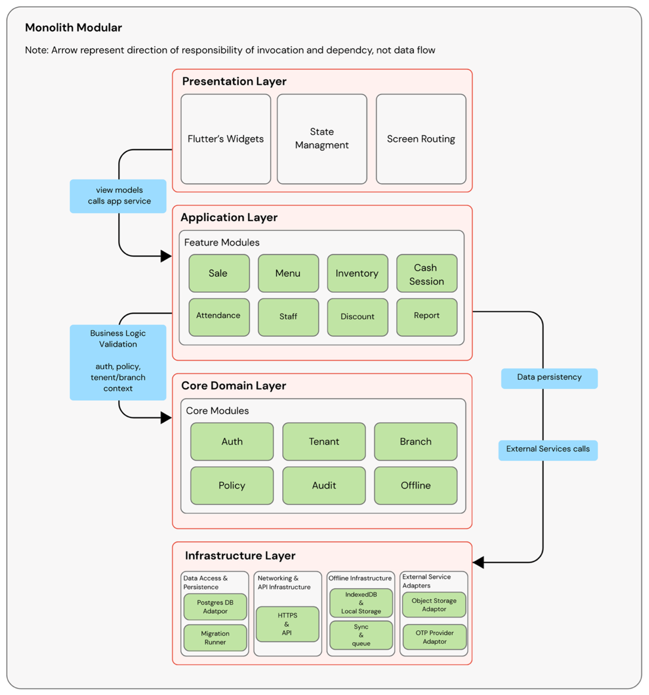

### 5.2.2 Logial Architecuture

The Modula POS system adopts a modular monolithic logical architecture, designed to balance clarity, maintainability, and scalability while remaining practical for a small development team and an evolving product roadmap. Rather than decomposing the system into distributed microservices, Modula organizes functionality into clearly defined modules within a single deployable application. This approach reduces operational complexity while still enforcing strong separation of concerns and modular boundaries.
The logical architecture defines how responsibilities are structured within the system, how data flows between components, and how business rules are enforced consistently across different features. By explicitly separating core system responsibilities from feature-specific logic and infrastructure concerns, Modula ensures that the system can evolve incrementally without destabilizing existing functionality.
Layer Architectural Model Modula’s logical architecture is organized into four primary layers: the Presentation Layer, the Application (Feature) Layer, the Core Domain Layer, and the Infrastructure Layer. Each layer has a distinct responsibility and communicates with adjacent layers through well-defined interfaces.

-  Presentation Layer
    -   The Presentation Layer is responsible for all user-facing interactions. In Modula, this layer is implemented using Flutter and consists of screens, widgets, and state management logic that render the user interface for administrators, managers, and cashiers.
   -   State management within the Presentation Layer is handled using Riverpod, which enables reactive, testable, and dependency-aware state handling. Riverpod supports Modula’s modular frontend design by allowing each feature module such as sales, inventory, or attendance to manage its own state independently while still consuming shared application context such as authentication status, tenant identity, branch context, and policy configuration 
   -   Importantly, the Presentation Layer does not enforce business rules. Instead, it reacts to capabilities, roles, and policy values provided by the underlying layers. User interface elements may be hidden or disabled based on permissions or policies, but final enforcement occurs outside the UI. This prevents duplication of logic and reduces the risk of inconsistent behavior across different screens or devices.
-   Application (Feature) Layer
    -   The Application Layer contains Modula’s feature modules, each responsible for a specific business capability. These include modules such as Sale, Menu, Inventory, Cash Session, Staff Attendance, Discount Management, Reporting, and Receipt handling.
    -   Feature modules orchestrate business workflows and coordinate interactions between the Presentation Layer, Core Domain Layer, and Infrastructure Layer. For example, a sale workflow may involve validating policy values, checking cash session status, applying discounts, deducting inventory, generating audit logs, and updating order status. While multiple modules may be involved in this process, the Sale module remains responsible for the overall transaction flow.
    -   Feature modules do not manage user identity, permissions, or tenant isolation directly. Instead, they consume these concerns from the Core Domain Layer. This separation ensures that cross-cutting rules such as authorization checks or tenant boundaries are applied consistently across all features.
-   Core Domain Layer
    -   The Core Domain Layer contains Modula’s core modules, which provide system-wide guarantees and shared services. These include Authentication and Authorization, Tenant and Branch Context, Policy and Configuration, Sync and Offline Support, and Audit Logging.
    -   Core modules encapsulate stable domain concepts that should remain consistent even as features evolve. Authentication rules, tenant isolation, and policy evaluation are centralized in the Core Domain Layer rather than duplicated across feature modules. This improves maintainability and reduces the risk of security or data integrity issues.
    -   A key architectural principle in Modula is that feature modules depend on core modules, but core modules do not depend on feature modules. This dependency direction reinforces modular boundaries and allows feature modules to evolve without destabilizing core system behavior.
-   Infrastructure Layer
    -   The Infrastructure Layer provides the technical foundations required to execute the system. This includes database access, API communication, offline storage mechanisms, synchronization queues, and idempotency handling.
    -   It also contains the integration adapters for external services that are not part of the domain logic but are required operationally, such as:
        -   Object storage adapters (e.g., Cloudflare R2 for images)
        -   OTP provider adapters (e.g., SMS gateways) for identity verification workflows
    -   Infrastructure components are deliberately kept free of business logic. Their role is to enable persistence, communication, and execution not to decide how the system behaves. For example, the Infrastructure Layer uploads an image to object storage, but it does not decide whether the user is authorized to change a menu item; that rule lives in the domain/application layers.
    -   This separation allows Modula to evolve its infrastructure (such as migrating storage providers or changing deployment models) without rewriting feature or core domain logic.
-   Inter-Layer Communication
    -   Communication between layers follows a strict and predictable flow. The Presentation Layer interacts with the Application Layer through view models and controllers. The Application Layer consults the Core Domain Layer for authorization, policy evaluation, and tenant/branch context, and relies on the Infrastructure Layer for persistence and external integrations.
    -   Direct interaction between the Presentation Layer and Infrastructure services is explicitly avoided. This prevents tight coupling between UI code and network/storage logic, improving testability and long-term maintainability.
- Modularity and System Evolution
  - By adopting a modular monolithic logical architecture, Modula achieves a balance between flexibility and simplicity. Modules are independently developed and evolved yet remain part of a single cohesive system. This supports Modula’s long-term vision of growing from an academic project into a commercial platform, while avoiding premature architectural complexity.
  - The logical architecture also complements Modula’s policy-driven design. Policies defined in the Core Domain Layer dynamically influence both feature behavior and user interface rendering, enabling the system to adapt to different business configurations without structural changes.
  - Overall, Modula’s logical architecture provides a clear, maintainable, and extensible foundation that aligns technical design with real-world business requirements and long-term system evolution.

