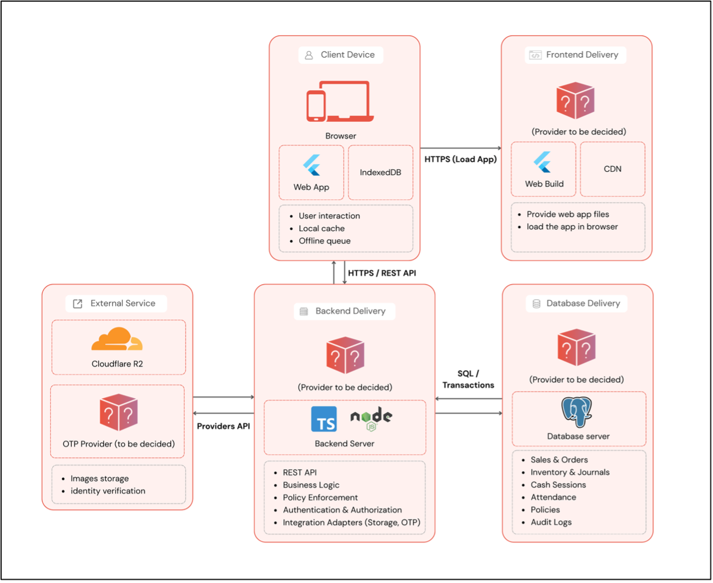

### 5.2.1 Physical Architecture

The Modula POS system adopts a distributed, web-based physical architecture designed to support accessibility, scalability, and long-term evolution from an academic capstone project into a production-ready software platform. The physical architecture defines how system components are deployed, where they execute, and how they communicate with one another across different environments.
At the time of Capstone I, the physical architecture of Modula is intentionally defined independently of any specific hosting vendor. This decision allows the system to remain provider-agnostic and supports future migration and scaling strategies described in the project’s long-term infrastructure vision. Specific hosting providers will be evaluated and selected in Capstone II based on operational, reliability, and cost considerations. By deferring vendor lock-in, Modula maintains architectural flexibility while still establishing a clear and complete deployment model.

- Client Layer: 
  - The client layer consists of end-user devices through which staff and administrators interact with the system. These devices include smartphones, tablets, and desktop or laptop computers commonly used in café and restaurant environments. In Capstone I, Modula is delivered as a web-based application accessed through modern web browsers, while future phases plan to introduce native mobile applications.
  - Client devices are responsible for rendering the user interface, handling user interactions, and managing local application state. To support real-world operating conditions such as unstable or unavailable internet connectivity the client layer incorporates local data storage using IndexedDB. This enables offline access to essential data such as menus and policies, as well as temporary storage of queued actions that can be synchronized once connectivity is restored. This design directly addresses the operational constraints of small and medium-sized F&B businesses, particularly in regions with inconsistent network reliability.
   
- Frontend Deployment:
  - The frontend application is deployed as static web assets generated from the Flutter framework. These assets are served through a web server and may be distributed via a content delivery mechanism to improve load performance and availability. The frontend communicates with backend services exclusively through secure HTTPS-based APIs.
  - From a physical deployment perspective, the public-facing website and the POS application are logically separated, even if they share underlying infrastructure during early deployment stages. This separation reduces operational risk, as traffic spikes or potential denial-of-service events targeting the public website are less likely to impact the POS service used for daily business operations.
- Backend Application Layer:
  - The backend layer executes as a server-side application that exposes a set of RESTful APIs. It encapsulates the core business logic of Modula, including authentication and authorization, sales processing, inventory management, cash session handling, staff attendance tracking, policy enforcement, and reporting.
  - The backend is designed to be largely stateless, with persistent state stored in the database layer. This approach enables horizontal scaling and simplifies recovery and maintenance. The backend also serves as the central authority for enforcing business rules and access control, ensuring that all operations comply with tenant-specific policies and role-based permissions.
- Database Layer:
  - Persistent data storage is handled by a relational database management system, specifically PostgreSQL. The database stores critical operational data such as sales transactions, inventory records, staff attendance logs, policy configurations, and audit logs. PostgreSQL was selected for its strong ACID guarantees, support for complex relational data models, and suitability for financial and transactional systems.
  - The database layer enforces data integrity and tenant isolation, ensuring that data belonging to one tenant cannot be accessed or modified by another. Automated backup and recovery mechanisms are part of the intended deployment design, reflecting the system’s role as a business-critical application where data loss would have significant consequences.
- Media Storage Service (Images and assets)
  - In addition to structured transactional data, Modula manages media assets primarily images for menu items and stock items. Rather than storing images directly in PostgreSQL, Modula uses an external object storage service for scalability and cost-efficiency.
  - In the current implementation, Modula integrates with Cloudflare R2 as the object storage layer. Images are uploaded from the client through backend-controlled APIs, and the backend stores only the necessary metadata (such as object keys/paths and public or signed access URLs, depending on the access model). This approach keeps the database lean and avoids using relational storage for large binary files while still ensuring that assets remain consistently associated with the correct tenant and branch context.
  - This external storage component is part of the physical architecture because it is a separate deployed service that the backend depends on at runtime for asset upload and retrieval.
- Identity/OTP Service (Credential Validation Path):
  - Modula’s authentication design supports secure credential validation and account recovery flows. While Modula currently operates without email-based identity, the intended approach for registration and credential-change verification is OTP (One-Time Password) delivered via SMS (or equivalent provider-supported channel).
  - From a physical architecture perspective, OTP delivery is treated as an external service dependency (e.g., an SMS gateway provider) accessed only by the backend. The client requests verification, the backend interacts with the OTP provider; and the backend remains the source of truth for validation and security rules (attempt limits, expiry windows, and abuse prevention). This integration is considered part of the architecture even if some OTP enforcement steps are still evolving during Capstone I.
- Local Storage and Offline Support:
  - In addition to server-side persistence, Modula incorporates client-side storage using IndexedDB to support offline-first behavior. When the network is unavailable, the system allows users to continue viewing data and performing permitted actions, which are stored locally and queued for later synchronization. Once connectivity is restored, queued operations are transmitted to the backend in a controlled and idempotent manner.
  - This hybrid storage model improves system reliability and usability, ensuring uninterrupted operations during temporary network outages and reducing unnecessary data traffic by caching frequently accessed reference data.
- Communication and Integration: 
  - All communication between system components follows a clear and secure interaction model:
    - Client devices communicate with backend services via HTTPS-based REST APIs.
    - 	Backend services interact with PostgreSQL through secured database connections.
    - Backend services integrate with external providers (object storage, OTP delivery) using provider APIs and secured credentials.
    - There is no direct communication between client devices and the database or external providers, which helps maintain strong security boundaries and reduces the attack surface.
    - This layered communication model supports centralized enforcement of policies, consistent validation of business rules, and comprehensive audit logging across all system activities.
  
