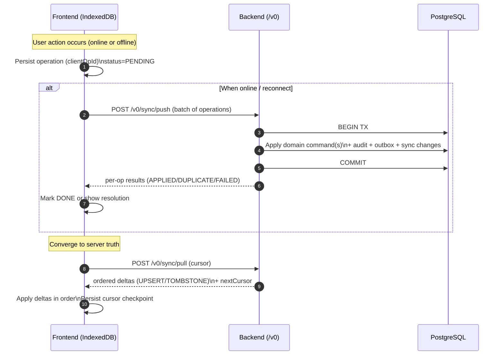
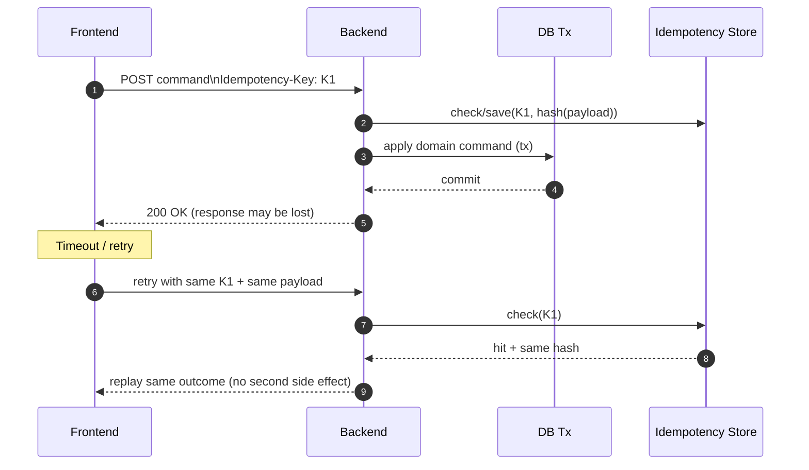
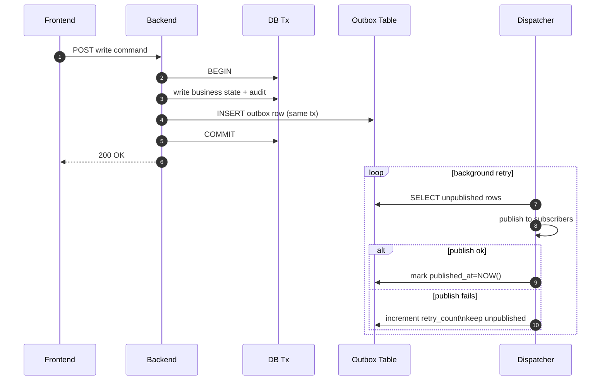

# 6. Implementation

This chapter explains how Modula is being realized in Capstone II as a production-oriented `/v0` system. It focuses on runtime interactions (topology), practical project setup, configuration, and how core/feature modules map to the implemented architecture.

Where this report requires implementation progress status, repositories, screenshots, or environment specifics that are not captured in the KB, it uses `TODO_CAPSTONE2(...)` flags.

TODO_CAPSTONE2(FLAG-INT-01): summarize what is currently integrated end-to-end in `/v0` (demoable flows) vs what is still separate FE/BE work.

---

## 6.1 Project Topology

This section provides a runtime interaction view of `/v0`, connecting the physical and logical architecture from Chapter 5 to how the system behaves during normal operation and under intermittent connectivity.

### 6.1.1 Runtime Components

Planned/implemented runtime components for Capstone II:

- Client application (Flutter Web) with IndexedDB for local cache + durable offline operation queue.
- Backend API service (TypeScript) exposing feature endpoints (online lane), sync endpoints (push replay + pull hydration), and SSE notifications for sync “nudge” events.
- Primary database (PostgreSQL on Supabase) as authoritative system-of-record.
- Background workers / dispatchers (server-side), including outbox dispatch (reliable post-commit event publication) and job scheduling (periodic/triggered jobs).
- External services including object storage (Cloudflare R2) for media, OTP (TBD) for account verification, and payment rails for KHQR verification and billing confirmation (Bakong).

TODO_CAPSTONE2(FLAG-FIG-01): provide an updated `/v0` topology figure (components + arrows + legends).

### 6.1.2 Interaction Principles

- Backend is authoritative for business invariants and policy enforcement.
- Client remains usable under poor connectivity and converges via push/pull synchronization.
- Delivery of sync changes and events is designed as at-least-once; consumers must be idempotent.
- All sensitive external integrations are mediated by the backend (no long-lived credentials in the client).

### 6.1.3 Meaning of Arrows in the Topology Diagram

- Solid arrows: synchronous HTTP request/response (feature APIs, sync APIs).
- Dashed arrows: asynchronous or deferred interactions (offline queue replay, outbox dispatch).
- One-way stream arrow: SSE notifications used as a trigger (“nudge”) for pull hydration.

### 6.1.4 Client–Backend Interaction

Client requests fall into three categories:

- Online lane: direct feature endpoints for normal UX when connected (writes are protected by idempotency identity).
- Offline replay lane: batched write intents are sent via `POST /v0/sync/push` when connectivity returns.
- Hydration lane: server-authoritative deltas are retrieved via `POST /v0/sync/pull` using cursors/checkpoints.

### 6.1.5 Backend–Database Interaction

All authoritative writes are executed inside database transactions to preserve consistency across:
- business state changes,
- audit logging,
- sync change feed production,
- and outbox records (for reliable downstream publication).

### 6.1.6 Offline Operation and Synchronization (Offline-First)

Capstone II `/v0` implements offline-first as a **dual-lane write model** plus **pull hydration**. The goal is to keep the POS usable under intermittent connectivity while ensuring that the backend remains the authoritative source of truth.

In the frontend, user actions are recorded as **operations** with stable identifiers (e.g., `clientOpId`) and stored durably in IndexedDB. Each operation includes an operation type, timestamp, payload, and optional dependencies (`dependsOn`). This queue enables the app to continue capturing intent even when the network is unavailable.

When connectivity is available, queued operations are replayed through a dedicated sync write interface:
- `POST /v0/sync/push`

The backend processes each operation deterministically:
- validates the actor and working context (tenant + branch),
- validates the payload and domain preconditions,
- enforces replay identity `(tenantId, branchId, clientOpId)` to prevent accidental duplicate processing,
- executes the same domain invariants as the online lane,
- commits business state + audit + outbox + sync change records in one transaction,
- returns per-operation results (`APPLIED`, `DUPLICATE`, `FAILED`) so the client can advance the queue.

Convergence is achieved using an authoritative read-model hydration interface:
- `POST /v0/sync/pull`

Rather than polling each feature module independently, the client pulls a single ordered change feed using cursor progression. Changes are returned as:
- `UPSERT` deltas (create/update), and
- `TOMBSTONE` deltas (deletion/archive markers),

and are applied locally in order. The client only advances its cursor checkpoint after all changes are applied successfully, which prevents partial-apply corruption.

To avoid heavy polling, `/v0` uses Server-Sent Events (SSE) as a **trigger** to run pull-sync when the server has new information:
- `GET /v0/notifications/stream`

SSE is intentionally used as a lightweight “nudge”, not as the authoritative state transport. The authoritative state transfer still happens via `sync/pull`.

Implementation notes and academic references (backend-provided resources):
- `_academic_report_component/backend_provided_academic_resource/offline-first-architecture-modula-v0.md`
- `_academic_report_component/backend_provided_academic_resource/offline-first-sync-interface-and-industry-notes.md`

TODO_CAPSTONE2(FLAG-FIG-07): decide which sync diagrams to include (push flow, pull flow, SSE trigger) and export them as figures for Word.

### 6.1.7 Integration with External Services

- OTP: account verification workflow depends on an OTP provider (TBD).
- Object storage: media assets are stored in R2; the DB stores metadata and references.
- Payment confirmation: KHQR/Bakong webhooks are normalized and ingested by the backend (webhook gateway) and dispatched into domain workflows.
- Billing collection: Capstone II avoids third-party billing vendors; it uses a payment verification approach instead.

TODO_CAPSTONE2(FLAG-BE-05): provide a short academically-safe explanation of billing payment verification (no secrets, no bank account identifiers).

### 6.1.8 Reliability Under Retries (Duplicate-Safe + Outbox)

POS systems operate in environments where networks are unstable, requests time out, and operators may double-tap UI actions. Capstone II `/v0` addresses these conditions via two complementary mechanisms: (1) duplicate-safe command execution (idempotent retry identity + domain guards) and (2) outbox-based reliable publication of post-commit events.

**Duplicate-safe command execution** (idempotency identity + domain guards):
- Online lane: `Idempotency-Key` per user intent.
- Offline lane: `clientOpId` per queued operation.
- Same identity + different payload is rejected deterministically (conflict).

**Outbox pattern** for reliable post-commit event publication:
- Write business state + audit + outbox record in the same DB transaction.
- Publish outbox events asynchronously with retry.

Backend-provided academic references:
- `_academic_report_component/backend_provided_academic_resource/duplication_safe_mechanism.md`
- `_academic_report_component/backend_provided_academic_resource/outbox-pattern-in-modula-v0.md`

TODO_CAPSTONE2(FLAG-FIG-07): if space allows, include one outbox sequence diagram and one duplicate-safe retry diagram as figures.

#### Duplicate-Safe Retry (Idempotency Identity)

The critical implementation rule is that the **identity is generated once per user intent**, then reused across retries caused by timeouts or reconnects. This prevents second-application of the same intent.

#### Outbox (Commit-Then-Publish with Retry)

Outbox prevents the “committed business state but lost event” failure mode. In `/v0`, the system records an outbox row in the same transaction as the business write, then publishes it asynchronously. If publishing fails, the dispatcher retries later until success.

### 6.1.9 Summary

This topology supports: offline-first operation, deterministic convergence, and reliability under retries, while keeping operational complexity low (modular monolith + background dispatchers).

---

## 6.2 Step of Implementation

This section describes how the team set up the project(s) and organized code to support parallel work and staged integration.

### 6.2.1 Project Setup

TODO_CAPSTONE2(FLAG-FE-01): confirm frontend setup details (Flutter version, key packages, build targets).
TODO_CAPSTONE2(FLAG-BE-01): confirm backend setup details (Node version, package manager, migration strategy).

### 6.2.2 Project Structure

TODO_CAPSTONE2(FLAG-FE-01): provide a short summary of the frontend folder structure (feature modules, routing, state management).
TODO_CAPSTONE2(FLAG-BE-01): provide a short summary of the backend folder structure (modules, platform systems, adapters).

---

## 6.3 Configuration

This section describes configuration management for Capstone II environments (local/dev/prod), without exposing secrets.

### 6.3.1 Environment Configuration

TODO_CAPSTONE2(FLAG-OPS-03): confirm frontend hosting and environment separation approach.
TODO_CAPSTONE2(FLAG-OPS-04): confirm OTP provider and required environment variables.

### 6.3.2 API Configuration

TODO_CAPSTONE2(FLAG-INT-02): document how FE targets BE environments (base URLs, auth environment switching).

### 6.3.3 Database Configuration

Capstone II uses Supabase PostgreSQL as the authoritative database.

TODO_CAPSTONE2(FLAG-BE-02): provide an academically-safe summary of schema/migrations strategy used in `/v0`.

### 6.3.4 Dependency and Runtime Configuration

TODO_CAPSTONE2(FLAG-BE-04): confirm runtime knobs for outbox/job scheduler (poll interval, batch size) to describe at a high level.

---

## 6.4 Implementation of Core and Feature Modules

This section summarizes the implementation approach and scope for the main modules in `/v0`.

TODO_CAPSTONE2(FLAG-BE-01): confirm what modules are implemented vs planned for Capstone II first draft.

### 6.4.1 Authentication and Account Verification

- User accounts exist independently of tenants.
- Account verification uses OTP as a prerequisite for membership workflows.

### 6.4.2 Tenant Membership and Branch Context

- Users can create tenants (as owners) or join tenants via invite/accept.
- Membership is tenant-scoped; branch assignment is managed by tenant admins/owners.

### 6.4.3 Subscription Entitlements and Branch Activation

- Branch is a billable workspace activation (not a reusable “slot” token).
- No unpaid branch exists by default; activation is tied to payment confirmation.

### 6.4.4 Policy and Governance

- Branch policies gate operational behavior (cash session requirements, pay-later policy, etc.).
- Subscription entitlements can gate module write capabilities (read-only discovery when disabled).

### 6.4.5 Sale and Order Management (Pay-First + Optional Pay-Later)

TODO_CAPSTONE2(FLAG-FE-01): provide screenshots/figures for checkout flows (cash vs KHQR; pay-first vs pay-later policy enabled).

### 6.4.6 Menu, Inventory, Discounts

- Menu and inventory are branch-scoped operational modules, with capability gating by subscription.
- Discount rules are branch-owned and follow an explicit lifecycle (inactive draft → activated; effective windows determine applicability).

### 6.4.7 Workforce and Attendance

- Workforce OFF implies solo-operator behavior; approvals are simplified accordingly.
- Workforce ON enables membership/assignment, multi-role operations, and approval workflows.

### 6.4.8 Printing and Peripherals (Pilot Scope)

- Receipt printing is triggered on sale finalization; kitchen printing is triggered by order placement (and item add events).
- Printing failures degrade gracefully (skip when disconnected) without breaking sales workflows.

TODO_CAPSTONE2(FLAG-OPS-01): confirm pilot printer models/connection details and what is in/out of scope for Capstone II.

### 6.4.9 Offline Sync Platform System

Summarize `/v0` sync endpoints and behavior:
- `POST /v0/sync/push`
- `POST /v0/sync/pull`
- `GET /v0/notifications/stream` (SSE trigger)

### 6.4.10 Webhook Gateway and Payment Confirmation

- External webhook events are ingested and normalized in a single gateway.
- Payment confirmation workflows subscribe to normalized events and apply domain rules deterministically.

### 6.4.11 Audit Logging

- Cross-cutting audit events are appended for critical actions and denials.
- Audit supports traceability during offline replay and subscription gating.

### 6.4.12 Background Jobs (Outbox + Scheduler)

- Outbox dispatcher runs continuously to publish committed events.
- Job scheduler runs periodic jobs required for operational correctness (renewal freeze, discount schedule, etc.).
