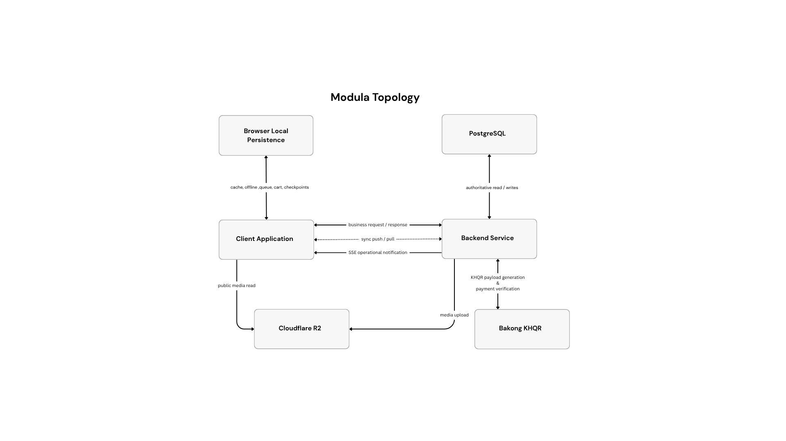
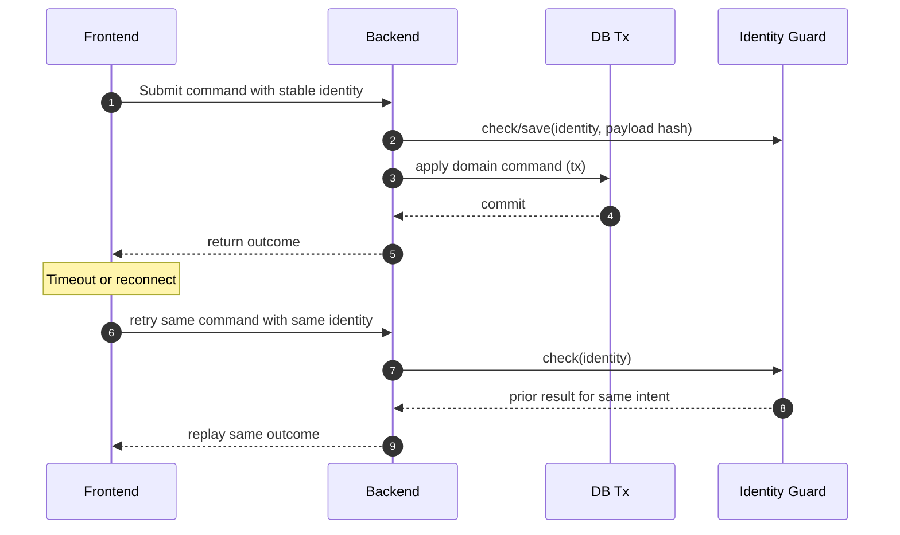
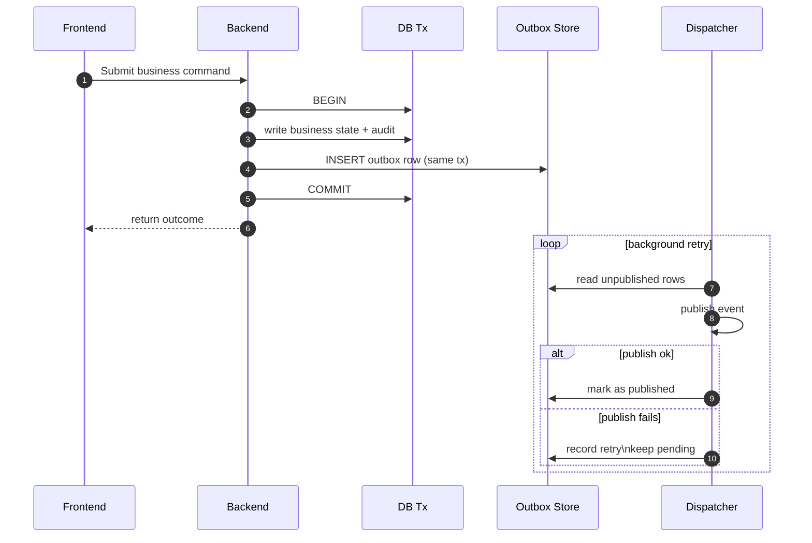

## 6.1 Project Topology
This section presents the project topology of Modula as a runtime view of the current implementation. Whereas Section 5.2.1 identifies the deployed components and Section 5.2.2 explains how responsibilities are organized, the topology focuses on how those parts exchange data during execution under normal and intermittent network conditions.

Figure 19 presents the high-level project topology of Modula, showing how the client application, local persistence, backend service, authoritative database, and external services cooperate during operation. Synchronization, notification delivery, webhook ingestion, and background jobs are treated as behaviors of the backend service rather than as separate top-level runtime units.

### 6.1.1 Runtime Components

At runtime, Modula consists of a browser-based Flutter client, browser local persistence, a backend API service, PostgreSQL, and a small set of external services. The client provides the operator-facing interface, while local persistence stores cached reference data, synchronization checkpoints, selected offline operations, outage-recovery records, current cart state, and small device or session records.

The backend is the main coordination point for business operations. It handles validation, policy enforcement, synchronization, and operational notifications. Background work such as outbox publication, media cleanup, and KHQR reconciliation runs inside the same backend process. PostgreSQL stores the authoritative business state together with audit, synchronization, and outbox data.

### 6.1.2 Interaction Principles

The topology follows a backend-centered interaction model. The client does not talk directly to the database or to sensitive external providers. The main exception is direct browser access to public media URLs after backend-managed upload. Local persistence improves resilience, but server state remains authoritative. Because some interactions are deferred or retried, the system relies on duplicate-safe processing and deterministic convergence.

### 6.1.3 Meaning of Arrows in the Topology Diagram

In Figure 19, solid arrows represent normal request-response exchanges. Dashed arrows represent deferred interactions such as offline replay or background processing. One-way arrows represent backend-to-client operational notifications. The arrows describe runtime communication, not code-level dependencies.

### 6.1.4 Client–Backend Interaction

Client interaction with the backend has three main patterns. The first is normal online requests for daily operations. The second is replay of selected offline actions after connectivity returns. The third is hydration from backend state so the client can converge with the server. Operational notifications are delivered through a separate long-lived stream and are not the main synchronization channel.

### 6.1.5 Backend–Database Interaction

All authoritative reads and writes pass through the backend into PostgreSQL. Multi-step operations are committed within database transactions so that business state, audit records, synchronization metadata, and deferred-work records remain consistent. This matters because one POS action can affect sales, inventory, cash accountability, and later synchronization at the same time.

### 6.1.6 Offline Operation and Synchronization (Offline-First)

Offline-first behavior is a key runtime property of the system. When connectivity is unavailable, the client stores selected operations locally so work can continue. This offline lane is selective rather than universal: some actions are queued for replay, while other local state such as the current sale cart is only restored locally.

When connectivity returns, the queued operations are submitted to the backend. The backend validates context and business preconditions, detects duplicate replay, and commits accepted changes together with audit, outbox, and synchronization records. The client then rehydrates from backend state. If no queued operations are pending, it can move directly to hydration.

Convergence is therefore server-led. The client applies ordered changes from the backend and advances its checkpoint only after successful application. Operational notifications may help the interface react quickly, but they do not replace the authoritative synchronization flow.

### 6.1.7 Integration with External Services

The main external services relevant to the current topology are Cloudflare R2 and Bakong KHQR. Media is uploaded through the backend to R2, while later reads use public media URLs directly in the browser. This direct media-read path is the main exception to the otherwise backend-centered model.

KHQR confirmation is also backend-mediated. The backend communicates with Bakong through provider calls and reconciliation polling, and it can accept webhook callbacks when they arrive. Billing and branch-activation confirmation still use a backend-managed verification flow rather than a live third-party billing gateway.

### 6.1.8 Reliability Under Retries (Duplicate-Safe + Outbox)

POS systems operate in environments where connections drop, responses time out, and operators may repeat the same action. In those conditions, reliability depends on protecting two different boundaries. The first is the command boundary: the system must avoid applying the same business action twice when requests are retried or replayed. The second is the post-commit boundary: once a business change is committed, any downstream publication or follow-up signal must not be lost. Modula addresses these two risks through duplicate-safe command execution and the outbox pattern.

Duplicate-safe execution means that one user intent is given one stable identity and that identity is reused across retries or offline replay. If the same intent arrives again, the system returns the same outcome instead of applying the effect twice. If the same identity arrives with a different payload, the request is rejected as conflicting. This protects the system from accidental double-application of business actions.

The outbox pattern solves a different problem. It ensures that once a business transaction succeeds, the corresponding post-commit publication is recorded durably in the same transaction and can be dispatched later by a background worker. In this way, the system avoids the failure mode in which business state is committed successfully but the related downstream event is lost.

Taken together, these mechanisms cover both sides of retry-safe operation. Duplicate-safe execution protects the transaction from being applied twice, while the outbox pattern protects committed side effects from disappearing after the transaction has already succeeded.

#### Duplicate-Safe Retry

The critical implementation rule is that the retry identity is generated once per user intent and then reused across timeouts, reconnects, or other retry conditions. This prevents second application of the same intent. Figure 20 illustrates this duplicate-safe retry flow.

Figure 20. Duplicate-safe retry using a stable request identity.

As shown in Figure 20, the backend checks whether the same command identity has already been processed before applying the command again. When a retry carries the same identity and the same intent, the system returns the original outcome instead of creating a second side effect.

Reliable publication of post-commit effects is therefore handled through the outbox pattern. When a business operation succeeds, the system stores the outbox record in the same transaction as the business state and audit data. Publication then occurs asynchronously through a background dispatcher. If delivery fails, the dispatcher retries later instead of losing the event.

#### Outbox (Commit-Then-Publish with Retry)

Figure 21 illustrates this commit-then-publish flow.

Figure 21. Outbox-based publication after a committed transaction.

As shown in Figure 21, the outbox record is written in the same transaction as the business state and audit data. Publication is then handled asynchronously by the dispatcher, which can retry failed deliveries without losing the fact that the business operation has already been committed.

### 6.1.9 Summary

As a runtime view, the project topology explains how Modula remains backend-centered while still supporting offline work, synchronization, notifications, and external integrations. It complements the physical and logical architecture by showing how those parts actually interact during operation.
